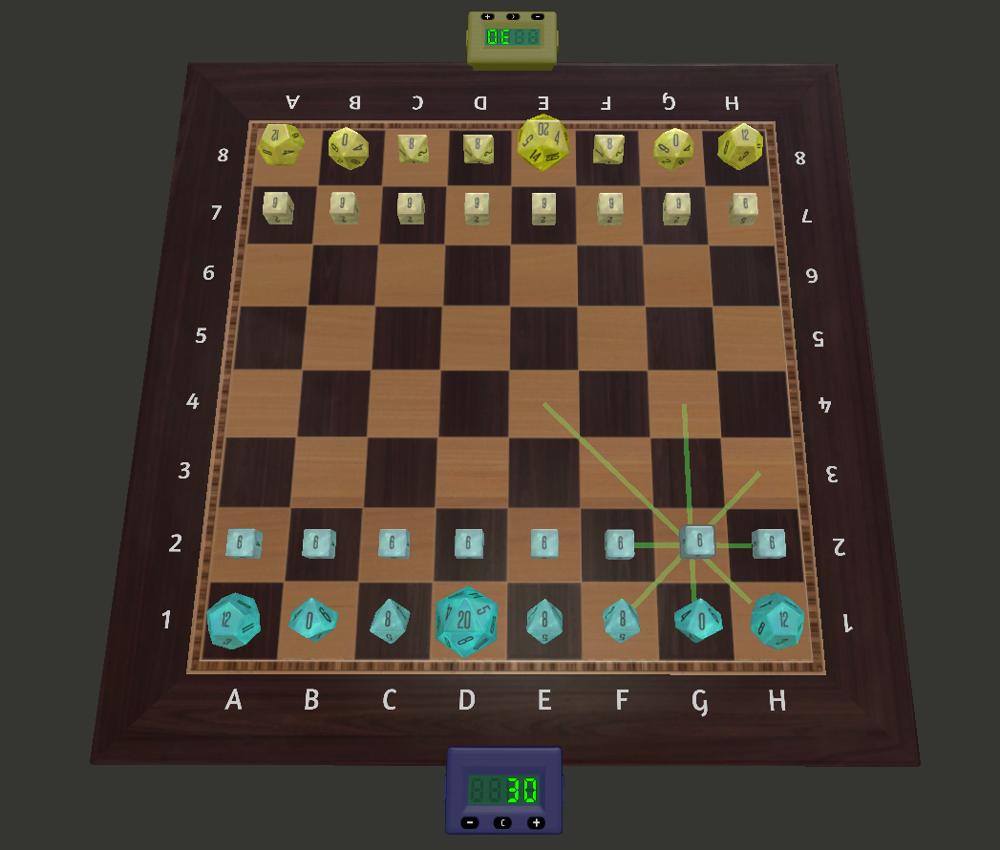
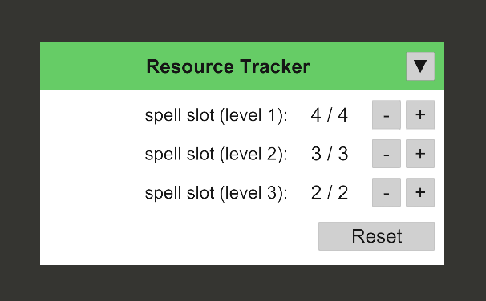
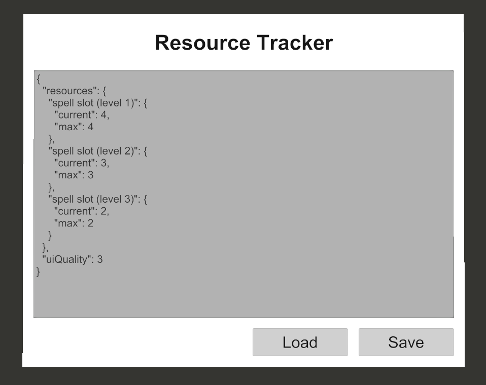

# Games

## DuRoBaI

A dice game on a chessboard. See [rules](mods/durobai/README.md).



# Tools

## Resource Tracker

Track resources like hit points or spell slots in D&D. Flip over to configure by writing JSON.

|||
|----|-----|
|||

Example config:

```json

{
  "resources": {
    "spell slot (level 1)": {
      "current": 4,
      "max": 4
    },
    "spell slot (level 2)": {
      "current": 3,
      "max": 3
    },
    "spell slot (level 3)": {
      "current": 2,
      "max": 2
    }
  },
  "uiQuality": 3
}
```

# Development

## Gotchas

* By default the UI orientation looks upside-down in alt-zoom, but turning UI breaks ScrollView, see [custom UI ScrollViews don't render properly when rotated](https://tabletopsimulator.nolt.io/429)

## VSCode config

```json
{
	"TTSLua.includeOtherFilesPaths": [
		"C:/Projects/Tabletop Simulator/mods",
		"C:/Projects/Tabletop Simulator/libraries"
	],
	"Lua.diagnostics.libraryFiles": "Enable",
	"Lua.completion.requireSeparator": "/",
	"Lua.runtime.pathStrict": true,
	"Lua.workspace.library": ["C:/Projects/Tabletop Simulator/libraries"],
	"TTSLua.bundleSearchPattern": ["?.ttslua", "?.lua", "?/init.lua"]
}
```

### Extensions

* [Lua]([Lua](https://marketplace.visualstudio.com/items?itemName=sumneko.lua))
* [Tabletop Simulator Lua](https://marketplace.visualstudio.com/items?itemName=rolandostar.tabletopsimulator-lua)
	* see [Not working for VS Code 1.94](https://github.com/rolandostar/tabletopsimulator-lua-vscode/issues/48#issuecomment-2405736522) issue
* [vscode-lua-format](https://marketplace.visualstudio.com/items?itemName=Koihik.vscode-lua-format)